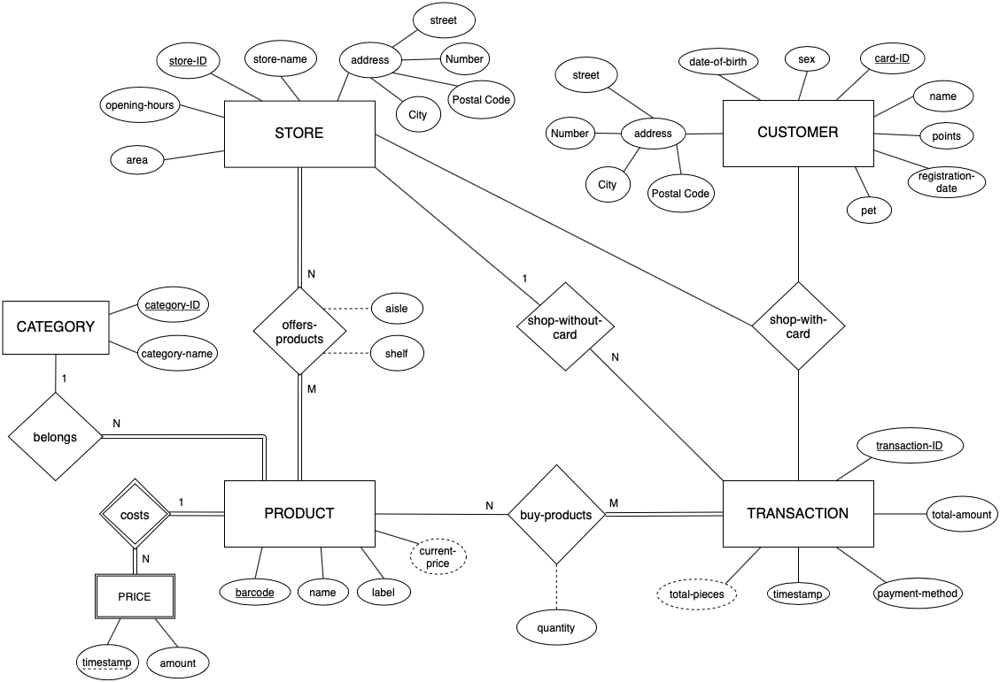
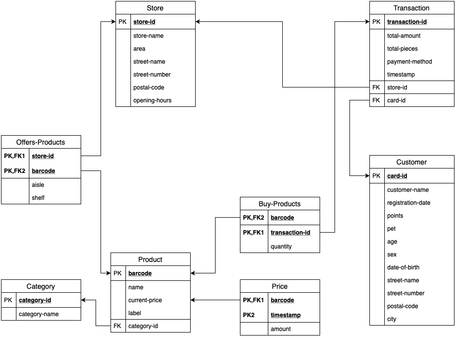

# supermarketDB


This project is a web application for statistical analysis of the transactions performed by registered and unregistered customers at a supermarket chain with many stores. All the data is stored in a database and the application user can modify the database contents. The application includes a website for data presentation and interaction with the database.

## E-R Model


## Relational Model


## Installation process
1. On a Linux machine install nginx web server.
```
$ sudo apt-get install nginx
```
2. Create a virtual enviroment to guarantee isolation.
```
$ sudo apt-get install python3-pip python3-dev
$ sudo pip3 install virtualenv
$ virtualenv dbenv
$ source dbenv/bin/activate
```
3. Install Flask microframework and uWSGI.
```
$ pip install uwsgi flask
```
4. Generate pseudo-random database data. The new data will be stored in CSV files, one for each database table.
```
$ cd generate_data
$ python generate_db_data.py
```
5. Connect to MySQL API and insert each CSV file to the database.
```
LOAD DATA LOCAL INFILE '<table>.csv' INTO TABLE <table>
FIELDS TERMINATED BY ','
ENCLOSED BY '"'
LINES TERMINATED BY '\n'
IGNORE 1 ROWS;
```
6. Run the application. The website is now available at ``` localhost:5000 ```
```
$ cd src
$ python backend.py
```
